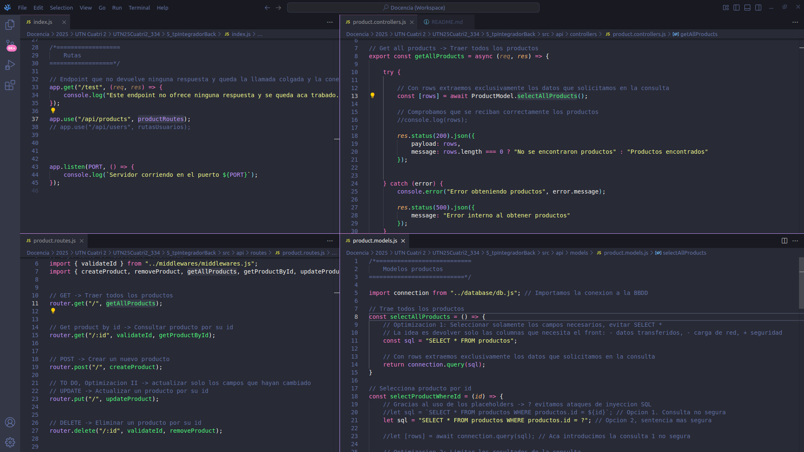
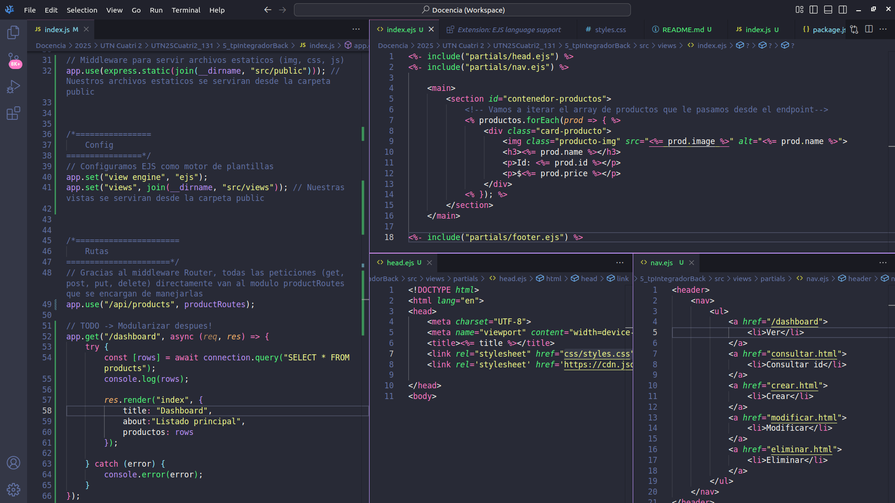

# TP Integrador Div 334 Back :computer: :frog:

## Guia

## 1 / Configuracion inicial de proyecto

### 1.1 Instalacion y archivos basicos
- Instalamos Node.js y NPM e inicializamos el proyecto con
```sh
npm init -y
```

- Creamos el archivo principal `index.js` y el archivo de documentacion `README.md`

### 1.2 Instalacion de dependencias
Recordemos que muchas veces, los pasos a seguir van a ser 
    1. Instalacion (de modulos)
    2. Importacion (de modulos)
    3. Inicializacion (utilizacion de todos los metodos y funciones de ese modulo)

- **express**: Framework minimalista Node.js para crear servidores web
- **mysql2**: Cliente mysql para Node.js
- **nodemon**: Herramienta que reinicia automaticamente la aplicacion Node.js cuando detecta cambios en los archivos
- **dotenv**: Modulo que carga variables de entorno desde un archivo `.env` al entorno de ejecucion de Node.js

```sh
npm install express mysql2 nodemon dotenv
```


### 1.3 Setup del proyecto
- **Creamos el archivo `.gitignore` y le agregamos las lineas `node_modules` y `.env`**
```txt
node_modules
.env
```

- Creamos un script personalizado en `package.json`

- Agregamos el type module para poder usar la sintaxis moderna ES6 llamada ESM o EcmaScript Modules
```json
  "type": "module",
  "scripts": {
    "dev": "nodemon index.js",
    "test": "echo \"Error: no test specified\" && exit 1"
  },
```
- **Recordemos que todos los scripts los ejecutamos con el nombre `npm run nombreScript`**

### 1.4 Creamos el archivo de variables de entorno `.env`
- Creamos el archivo .`env` que va a contener informacion sensible de nuestro proyecto
- En nuestro archivo .env le agregamos las variables locales sensibles como el puerto o la conexion a la BBDD

```txt
PORT=3000
DB_HOST="localhost"
DB_NAME="tp_prog_iii"
DB_USER="root"
DB_PASSWORD="abc123."
```

---


## 2 / Estructura de directorios y conexion a la BBDD
- Creamos la nueva carpeta y archivo `src/api/config/environments.js` para procesar y exportar la informacion de nuestras variables de entorno
```js
// environments.js
import dotenv from "dotenv";

dotenv.config(); // El metodo config carga las variables de entornop desde nuestro archivo .env

export default { // Vamos a exportar esta informacion sensible
    port: process.env.PORT || 3100,
    database: {
        host: process.env.DB_HOST,
        name: process.env.DB_NAME,
        user: process.env.DB_USER,
        password: process.env.DB_PASSWORD
    }   
}
```

- Creamos la nueva carpeta y archivo `src/api/database/db.js`, que sera el modulo que creara y exportara la conexion a nuestra BBDD
```js
// db.js
import mysql2 from "mysql2/promise"; // Importamos el modulo mysql2 en modo promesas para hacer peticiones asincronicas a la BBDD

import environments from "../config/environments.js"; // Importamos la informacion de conexion a nuestra BBDD

const { database } = environments; // Hacemos destructuring para guardar en la variable environments la informacion de la BBDD

const connection = mysql2.createPool({
    host: database.host,
    database: database.name,
    user: database.user,
    password: database.password
});

export default connection;
```

---

## 3 / Creacion de un primer endpoint + vista

### 3.1 Probando conexion a la BBDD con endpoint minimo

- Creamos un servidor minimo de Express.js
```js
// index.js
import express from "express";
const app = express();

import environments from "./src/api/config/environments.js";

const PORT = environments.port;

app.get("/", (req, res) => {
    res.send("Hola mundo desde Express.js");
});


app.listen(PORT, () => {
    console.log(`Servidor corriendo en el puerto ${PORT}`);
});
```

- **Ahora vamos a crear nuestro primer endpoint para traer todos los productos**
```js
// Traer todos los productos
app.get("/products", async (req, res) => {
    try {
        const sql = "SELECT * FROM productos";
        const [rows] = await connection.query(sql);

        res.status(200).json({
            payload: rows
        });
    
    } catch (error) {
        console.error("Error obteniendo productos", error.message);
        res.status(500).json({
            message: "Error interno al obtener productos"
        });
    }

});
```

### 3.2 Creamos la vista para conectar nuestra aplicacion del front para consumir estos datos que ahora le proporciona nuestro endpoint a traves de nuestra API Rest

### 3.3 Setup de [CORS](https://www.npmjs.com/package/cors)
- Para poder consumir nuestra API Rest desde el cliente, vamos a necesitar CORS
```sh
# Instalar CORS
npm i cors
```

- En nuestro archivo principal `index.js`, vamos a usar el middleware CORS
```js
app.use(cors()); //Middleware CORS basico que permite todas las solicitudes
```

- *En nuestro index.html usamos el siguiente JavaScript para consumir nuestra propia API Rest!*


---

## 4 / Creacion del CRUD, hacemos endpoint + optimizaciones + vistas
- **Todavia no modularizamos, seguimos en el index.js de la raiz del proyecto!**

---

### 4.1 Creamos middlewares para poder consumir la API REST, parsear los datos recibidos de un formulario y mostrar por consola las peticiones

- Escribimos los siguientes middlewares, que son funciones que se ejecutan entre cada solicitud y cada respuesta
```js
//Middleware CORS basico que permite todas las solicitudes
app.use(cors()); 

// Middleware que transforma el JSON de las peticiones POST y PUT a objetos JS para poder leer la info que recibimos de un <form>
app.use(express.json()); 

// Middleware logger para poder imprimir por consola cada peticion a nuestra API Rest
app.use((req, res, next) => {
    console.log(`[${new Date().toLocaleString()}] ${req.method} ${req.url}`);
    next(); // Con next continuamos al siguiente middleware o a la respuesta
});
```

---

### 4.2 Endpoint Get All Products + Vista

```js
// GET -> Traer todos los productos
app.get("/products", async (req, res) => {
    try {
        const sql = "SELECT * FROM productos";
        const [rows] = await connection.query(sql);

        res.status(200).json({
            payload: rows,
            message: rows.length === 0 ? "No se encontraron productos" : "Productos encontrados"
        });
            
    } catch (error) {
        console.error("Error obteniendo productos", error.message);

        res.status(500).json({
            message: "Error interno al obtener productos"
        });
    }
});
```

#### Vista de Get all products
```js
const url = "http://localhost:3000/api/products"; // Guardamos en una variable la url de nuestro endpoint

async function obtenerProductos() {
    try {
        let respuesta = await fetch(url); // Hacemos una peticion a nuestro nuevo endpoint en http://localhost:3000/api/products

        let data = await respuesta.json();

        let productos = data.payload; // Aca guardamos en la variable productos el array de productos que contiene 

        mostrarProductos(productos);

    } catch(error) {
        console.error(error);
    }
}

function mostrarProductos(array) {
    console.table(array); // Recibimos correctamente en formato tabla los productos que nos manda la funcion obtenerProductos()

    let htmlProducto = "";

    array.forEach(producto => {
        htmlProducto += `
            <div class="card-producto">
                
                <h5>${producto.name}</h5>
                <p>Id: ${producto.id}</p>
                <p>$${producto.price}</p>
            </div>
        `;
    });

    contenedorProductos.innerHTML = htmlProducto;
}

function init() {
    obtenerProductos()
}

init();
```

---

### 4.3 Endpoint obtener producto por id + vista

```js
// Get product by id -> Consultar producto por su id
app.get("/products/:id", async (req, res) => {
    try {
        let { id } = req.params; // Aca extraemos el valor "2" de localhost:3000/products/2
        let sql = "SELECT * FROM productos WHERE productos.id = ?"; 
        let [rows] = await connection.query(sql, [id]); // Este id reemplazara el placeholder ?

        if(rows.length === 0) {
            console.log(`Error! No se encontro producto con id ${id}`); // Este console.log es desde la consola del servidor
            // Esta respuesta se la brindamos al usuario y puede elegir verla por consola o por pantalla
            return res.status(404).json({
                message: `No se encontro producto con id ${id}`
            });
        }
 
        res.status(200).json({
            payload: rows,
            message: "Producto encontrado"
        });


    } catch(error) {
        console.error(`Error obteniendo productos con id ${id}`, error.message);
        res.status(500).json({
            message: "Error interno al obtener producto con id"
        })
    }
});
```

#### Vista de obtener producto por id
```js
let url = "http://localhost:3000/api/products";

getProduct_form.addEventListener("submit", async (event) => {

    event.preventDefault(); // Evitamos el envio por defecto del formulario

    // Vamos a guardar como objetos los valores del formulario HTML
    let formData = new FormData(event.target);
   
    // Vamos a transformar este objeto FormData en un objeto normal JavaScript
    let data = Object.fromEntries(formData.entries());
   
    let idProd = data.idProd;

    try {
        let respuesta = await fetch(`http://localhost:3000/api/products/${idProd}`);
     
        let datos = await respuesta.json();

        if(respuesta.ok) {
            let producto = datos.payload[0];
            mostrarProducto(producto);

        } else {
            console.error(datos.message);
            mostrarError(datos.message);
        }
        
    } catch (error) {
        console.log(error);
    }
    
});

function mostrarProducto(producto) {
    console.table(producto);

    let htmlProducto = `
        <li class="li-listados">
            
            <p>Id: ${producto.id} / Nombre: ${producto.nombre} / <strong>Precio: ${producto.precio}</strong></p>
        </li>
    `;

    listaProductos.innerHTML = htmlProducto;
}

// Imprimimos un mensaje visual de error
function mostrarError(error) {

    let htmlError = `
        <li class="mensaje-error">
            <p>
                <strong>Error:</strong>
                <span>${error}</span>
            </p>
        </li>
    `;

    listaProductos.innerHTML = htmlError;
}
```

---

### 4.4 Endpoint crear producto + vista

```js
// POST -> Crear un nuevo producto
app.post("/products", async (req, res) => {
    try {
        /* Recordatorio! Este middleware transformo el JSON en objetos JS
        
            app.use(express.json()); 
        
        Gracias a esto, podemos hacer desctructuring de los datos del req.body, si no, solamente recibiriamos texto plano JSON*/

        // Gracias al destructuring, recogemos estos datos del body
        let { image, name, price, type } = req.body;

        // Optimizacion 1: Validacion de datos de entrada
        if(!image || !name || !price || !type) {
            return res.status(400).json({
                message: "Datos invalidos, asegurate de enviar todos los campos"
            });
        }

        let sql = `INSERT INTO productos (imagen, nombre, precio, tipo) VALUES (?, ?, ?, ?)`;

        let [result] = await connection.query(sql, [image, name, price, type]);
        
        // Codigo de estado 201 -> Created
        res.status(201).json({
            message: "Producto creado con exito",
            productId: result.insertId
        });


    } catch(error) {
        console.log(error);

        res.status(500).json({
            message: "Error interno del servidor",
            error: error.message
        })
    }
});
```

#### Vista de crear producto
```js
 let url = "http://localhost:3000/api/products";

altaProductsForm.addEventListener("submit", async (event) => {

    event.preventDefault(); // Formulario no enviado por defecto

    // Obtenemos los datos de este formulario a traves de un objeto FormData
    let formData = new FormData(event.target);
   
    // Ahora creamos un objeto JS a partir de los datos de este objeto FormData
    let data = Object.fromEntries(formData.entries()); // Ya tenemos nuestro objeto con todos los valores del fomulario para mandarlos al servidor
 
    // Ahora, con el nuevo objeto JS creado a partir de los valores de nuestros formularios, se lo enviamos al servidor en formato JSON
    
    try {
        // Para hacer otras operaciones distintas a GET, necesitamos especificar mas informacion en el segundo parametro de fetch
        let response = await fetch(url, { // Este 2o parametro es un objeto de opciones
            method: "POST",
            headers: {
                "Content-Type": "application/json"
            },
            body: JSON.stringify(data)
        }); 
        
        let result = await response.json();

        if (response.ok) {
            console.log(result.message);
            alert(`Producto creado con exito con id: ${result.productId}`);
        } else {
            alert(`Error en la creacion de producto: ${result.message}`);
        }

    } catch(error) {
        console.error("Error al enviar los datos: ", error);
        alert("Error al procesar la solicitud");
    }
});
```

---

### 4.5 Endpoint modificar producto + vista

```js
// UPDATE -> Actualizar un producto por su id
app.put("/products", async (req, res) => {
    try {
        let { id, name, image, type, price, active } = req.body;

        // Optimizacion 1: Validacion basica de datos recibidos
        if(!id || !name || !image || !type || !price || !active) {
            return res.status(400).json({
                message: "Faltan campos requeridos"
            });
        }

        let sql = `
            UPDATE productos
            SET nombre = ?, imagen = ?, tipo = ?, precio = ?, activo = ?
            WHERE id = ?
        `;

        let [result] = await connection.query(sql, [name, image, type, price, active, id]);
        console.log(result);

        // Optimizacion 2: Testeamos que se actualizara, esto lo sabemos gracias a affectedRows que devuelve result
        if(result.affectedRows === 0) { // No se actualizo nada
            return res.status(400).json({
                message: "No se actualizo el producto"
            });
        }

        res.status(200).json({
            message: `Producto con id ${id} actualizado correctamente`
        });

    } catch (error) {
        console.error("Error al actualizar productos", error);

        res.status(500).json({
            message: "Error interno del servidor", error
        });
    }
});
```

#### Vista para modificar productos (combinacion de consultar y crear)
```js
let url = "http://localhost:3000/api/products";

// PASO 1 -> Recibimos el ID, reciclamos la consulta de producto
getProduct_form.addEventListener("submit", async (event) => {

    event.preventDefault(); // Evitamos el envio por defecto del formulario

    console.log("Formulario no enviado");
    console.log(event.target); // Con event target accedemos al evento que disparo el addEventListener
    
    // Vamos a guardar como objetos los valores del formulario HTML
    let formData = new FormData(event.target);
    console.log(formData); // FormData { idProd → "2" }
    
    // Vamos a transformar este objeto FormData en un objeto normal JavaScript
    let data = Object.fromEntries(formData.entries());
    console.log(data); // Object { idProd: "3" }
    
    let idProd = data.idProd;
    console.log(idProd); // 3

    console.log(`Extraido valor numerico del formulario en la variable idProd, que vale ${idProd}`)
    
    
    try {
        console.log(`Haciendo peticion GET a la url: ${url}/${idProd}`)
        //let respuesta = await fetch(`${url}/${idProd}`);
        let respuesta = await fetch(`http://localhost:3000/api/products/${idProd}`);

        let datos = await respuesta.json();

        let producto = datos.payload[0];

        mostrarProducto(producto); // Le pasamos el producto a la funcion mostrarProducto
        
    } catch (error) {
        console.log(error);
    }
    
});


// Paso 2: Recibe el producto y lo muestra por consola y por pantalla, agregando un boton de modificacion de ese producto
function mostrarProducto(producto) {
    console.table(producto);

    let htmlProducto = `
        <li class="li-listados">
            
            <p>Id: ${producto.id} / Nombre: ${producto.nombre} / <strong>Precio: ${producto.precio}</strong></p>
        </li>
        <li class="li-botonera">
            <input type="button" id="updateProduct_button" value="Actualizar producto">
        </li>`;

    listaProductos.innerHTML = htmlProducto;

    // Seleccionamos el boton de actualizar y le asignamos un evento
    let updateProduct_button = document.getElementById("updateProduct_button");
    
    updateProduct_button.addEventListener("click", event => {
        formularioPutProducto(event, producto);
    });
}


// Paso 3 -> Creamos el formulario de create product pero con los valores previos insertos en un value=""
function formularioPutProducto(event, producto) {

    event.stopPropagation(); // Evita la propagacion de eventos para que un evento no pise al otro

    let updateForm_html = `
            <form id="updateProducts-form">

                <input type="hidden" name="id" id="idProd" value="${producto.id}">

                <label for="nameProd">Nombre</label>
                <input type="text" name="name" id="nameProd" value="${producto.nombre}" required>

                <label for="imageProd">Url imagen</label>
                <input type="text" name="image" id="imageProd" value="${producto.imagen}" required>

                <label for="typeProd">Tipo</label>
                <select name="type" id="typeProd" required>
                    <option value="LP">LP</option>
                    <option value="CD">CD</option>
                </select>

                <label for="priceProd">Precio</label>
                <input type="number" name="price" id="priceProd" value="${producto.precio}" required>

                <label for="activeProd">Disponibilidad</label>
                <select name="active" id="activeProd" required>
                    <option value="0">Inactivo</option>
                    <option value="1" selected>Activo</option>
                </select>

                <br>
                <input type="submit" value="Actualizar producto">
            </form>
    `;

    contenedor_update.innerHTML = updateForm_html;

    let updateProducts_form = document.getElementById("updateProducts-form");


    // Paso 4 -> Enviamos el nuevo formulario con todos los datos, modificados o no
    updateProducts_form.addEventListener("submit", async event => {
        
        event.preventDefault(); // Prevengo el envio por defecto del formulario

        let formData = new FormData(event.target);

        let data = Object.fromEntries(formData.entries());

        try {
            let response = await fetch(url, {
                method: "PUT",
                headers: {
                    "Content-Type": "application/json"
                },
                body: JSON.stringify(data)
            });

            // Esperamos a procesar la respuesta del servidor
            let result = await response.json(); 

            if(response.ok) { // 200 OK
                console.log(result.message);
                alert(result.message);

                // Vaciamos la lista de productos y el formulario de actualizacion
                listaProductos.innerHTML = "";
                contenedor_update.innerHTML = "";

            } else {
                console.error("Error: ", result.message);
                alert(result.message);
            }

        } catch(error) { // El catch en nuestra solicitud fetch SOLO capturan errores reales de red
            console.error("Error al enviar los datos: ", error);
            alert("Error al procesar la solicitud")
        }
    });
}
```

---

### 4.6 Endpoint eliminar producto + vista
```js
// DELETE -> Eliminar un producto por su id
app.delete("/products/:id", validateId, async (req, res) => {
    try {
        let { id } = req.params;

        let sql = "DELETE FROM productos WHERE id = ?";

        let [result] = await connection.query(sql, [id]);

        // Optimizacion 2: Testeamos que se borro, esto lo sabemos gracias a affectedRows que devuelve result
        if(result.affectedRows === 0) { // No se borro nada
            return res.status(400).json({
                message: "No se eliminó el producto"
            });
        } 

        return res.status(200).json({
            message: `Producto con id ${id} eliminado correctamente`
        });

    } catch(error) {
        console.error("Error al eliminar un producto: ", error);

        res.status(500).json({
            message: `Error al eliminar un producto con id ${id}: `, error,
            error: error.message
        })
    }
});
```

#### Vista de eliminar producto
```js
let url = "http://localhost:3000/api/products";


getProduct_form.addEventListener("submit", async (event) => {

    event.preventDefault(); // Evitamos el envio por defecto del formulario

    // Vamos a guardar como objetos los valores del formulario HTML
    let formData = new FormData(event.target);
   
    // Vamos a transformar este objeto FormData en un objeto normal JavaScript
    let data = Object.fromEntries(formData.entries());
   
    let idProd = data.idProd;
  
    try {
        console.log(`Haciendo peticion GET a la url: ${url}/${idProd}`)
        //let respuesta = await fetch(`${url}/${idProd}`);
        let respuesta = await fetch(`http://localhost:3000/api/products/${idProd}`);

        let datos = await respuesta.json();

        let producto = datos.payload[0];
        console.table(producto);

        // Creamos un nuevo boton a nuestro listado de ver producto
        let htmlProducto = `
            <li class="li-listados">
                
                <p>Id: ${producto.id} / Nombre: ${producto.nombre} / <strong>Precio: ${producto.precio}</strong></p>
            </li>
            <li class="li-botonera">
                <input type="button" id="deleteProduct_button" value="Eliminar producto">
            </li>
        `;

        // Renderizamos el listado en la pagina
        listaProductos.innerHTML = htmlProducto;


        // Vamos a asignarle un evento click a nuestro boton "Eliminar producto"
        let deleteProduct_button = document.getElementById("deleteProduct_button");

        deleteProduct_button.addEventListener("click", event => {

            event.stopPropagation(); // Evitamos la propagacion de eventos

            let confirmacion = confirm("Queres eliminar este producto?");

            if(!confirmacion) {
                alert("Eliminacion cancelada");

            } else {
                eliminarProducto(idProd);
            }
        });

        async function eliminarProducto(id) {
            console.log(id); // Recibimos correctamente el id

            try {
                let response = await fetch(`http://localhost:3000/api/products/${id}`, {
                    method: "DELETE"
                });

                let result = await response.json();

                if(response.ok) {
                    alert(result.message);

                    // Vaciamos la lista
                    listaProductos.innerHTML = "";
                }

            } catch(error) {
                console.error("Error en la solicitud DELETE: ", error);
                alert("Ocurrio un error al eliminar un producto");
            }
        }
        
    } catch (error) {
        console.log(error);
    }
});
```

---


## 5 / Resumen de [Modelo Vista Controlador](https://es.wikipedia.org/wiki/Modelo%E2%80%93vista%E2%80%93controlador)

- *Recordemos que ahora las rutas las gestiona el middleware Router -> Para esto, la llamada a las rutas usa `app.use()` -> no confundir con app.get()*

1. El `index.js` registra una peticion a `"/api/products"` y redirige a `productRoutes`
```js
// index.js
app.use("/api/products", productRoutes); // Recordemos que Router es un middleware, por eso app.use()
```

2. La ruta registra una peticion get con un id `"/:id`, aplica el middleware `validateId` y redirige al controlador `getProductById`
```js
// product.routes.js
router.get("/:id", validateId, getProductById); // Atajo, cortamos y pegamos todo, reemplazamos app. por router.
```

3. El controlador recibe una peticion y solicita al modelo `productModels` esa informacion
```js
// product.controllers.js
let [result] = await ProductModels.deleteProduct(id); // Pegamos toda la logica de (req, res) salvo la llamda a la BBDD que la hace el modelo
```

4. Finalmente, el modelo hace la consulta a la BBDD y le devuelve la solicitud al controlador
```js
// product.models.js
let sql = `SELECT * FROM products where id = ?`;
return connection.query(sql, [id]); // El id reemplaza nuestro ?
```



---


## 6 / Resumen de [EJS](https://www.npmjs.com/package/ejs)

Volvemos a hacer la logica anterior, ahora en las nuevas url, en lugar de devolver JSON, devolvemos las plantillas
```js
// index.js
app.get("/dashboard", (req, res) => {
    res.render("index");
})
```

Esto quiere decir que ahora visitando `localhost:3000/dashboard` se va a poder ver nuestra pagina `index.ejs`
**Ahora tendremos que hacer esto con cada una de las vistas!**

---

### 6.1 Cortamos todas las vistas de nuestro dashboard y las pegamos en /views en los respectivos ejs -> `consultar.html` a `consultar.ejs`
- El html de `consultar.html` va a `views/consultar.ejs`
- el js de `consultar.html` va a `/public/js/consultar.js`

---

### 6.2 Dividimos el HTML de las vistas y lo fragmentamos en la carpeta `views/partials`
- `head.ejs`
```html
<!DOCTYPE html>
<html lang="en">
<head>
    <meta charset="UTF-8">
    <meta name="viewport" content="width=device-width, initial-scale=1.0">
    <title>TP Integrador front</title>
    <script defer src="js/main.js"></script>
    <link rel="stylesheet" href="https://unpkg.com/sakura.css/css/sakura-vader.css" type="text/css">
    <link rel="stylesheet" href="css/styles.css">
</head>
<body>
```

---

- `nav.ejs` 
```html
<header>
    <nav>
        <ul>
            <a href="index.html">
                <li>Ver</li>
            </a>
            <a href="consultar.html">
                <li>Consultar id</li>
            </a>
            <a href="crear.html">
                <li>Crear</li>
            </a>
            <a href="modificar.html">
                <li>Modificar</li>
            </a>
            <a href="eliminar.html">
                <li>Eliminar</li>
            </a>
        </ul>
    </nav>
</header>
```

---

- `footer.ejs`
```html
</body>
</html>
```

---

### 6.3 Incorporamos estos fragmentos, para no repetirlos, en cada vista, como hacemos en `index.ejs`

```html
<%- include("partials/head.ejs") %>
<%- include("partials/nav.ejs") %>
    <main>
        <h1>Lista de productos</h1>
        <hr>
        <div id="contenedor-productos"></div>
    </main>
<%- include("partials/footer.ejs") %>
```

---




---